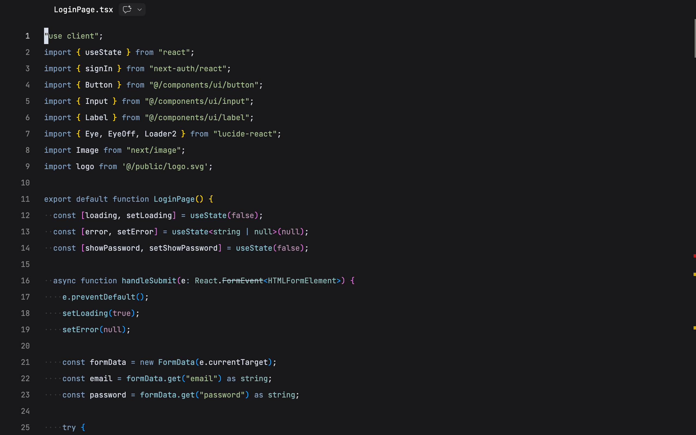
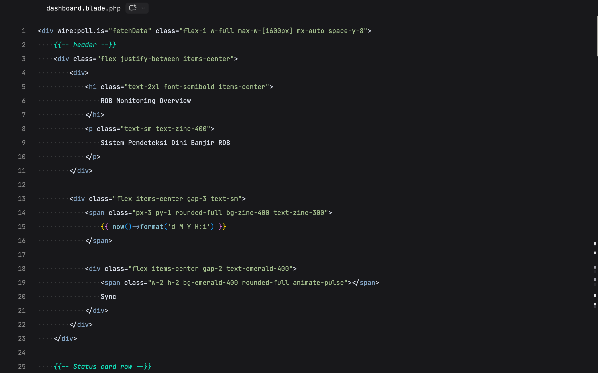

# Neutral Theme

Neutral theme is a refined dark theme inspired by the Nord color palette, redesigned with a neutral foundation to provide a calm, balanced, and distraction-free coding environment.

It combines cool Nordic tones with a carefully tuned neutral background to deliver clarity, consistency, and visual comfort across modern development workflows.

---

## Overview

Adtzslowy Nordish is built with a clear objective: reduce visual noise while preserving semantic clarity.

Instead of relying on high contrast or aggressive color accents, this theme uses harmonized, muted tones to support extended coding sessions without fatigue. The result is a professional and focused workspace suitable for full-stack development.

---

## Preview

### JavaScript / TypeScript



### React (JSX / TSX)


### Laravel (Blade / PHP)




## Design Philosophy

- Neutral dark background to minimize eye strain  
- Cool gray foreground for comfortable readability  
- Muted Nord-inspired accents for structural clarity  
- No italic or bold styling for visual consistency  
- Underline reserved exclusively for interactive elements  
- Consistent visual hierarchy across languages  

Every color choice is intentional and optimized for long-term usability.

---

## Language Support

Adtzslowy Nordish is tuned and tested for:

- HTML  
- CSS / SCSS / SASS  
- JavaScript  
- TypeScript  
- React (JSX / TSX)  
- Laravel (PHP & Blade)  

Syntax highlighting remains consistent and balanced across these environments.

---

## Key Features

- Clear distinction between native HTML tags and React components  
- Subtle and readable comment styling  
- Balanced keyword and function highlighting  
- Harmonized color palette across the entire UI  
- Optional terminal ANSI color support for consistency  

---

## Installation

### Install via VSIX

1. Download the `.vsix` file  
2. Open Visual Studio Code  
3. Go to Extensions  
4. Click the `...` menu  
5. Select **Install from VSIX...**  
6. Choose the downloaded file  

### Activate Theme

1. Open Command Palette  
2. Search for **Color Theme**  
3. Select **Adtzslowy Nordish**

---

## Recommended Setup

For the best experience:

- Use a regular-weight monospaced font (e.g., JetBrains Mono, Fira Code, Cascadia Code)  
- Keep monitor brightness at a moderate level  
- Enable custom title bar styling for visual consistency  

---

## Development

To build the extension locally:

```bash
npm install
vsce package
```

---

## Install Localy
```bash
code --install-extension adtzslowy-nordish-x.x.x.vsix
```

## License
MIT License
